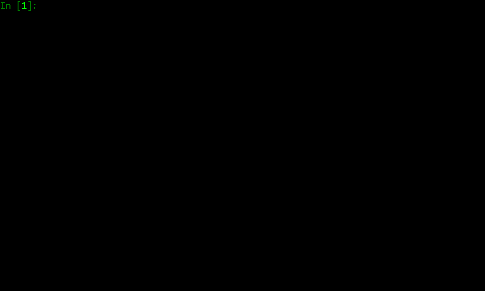

# Binarytree: Python Library for Studying Binary Trees


[](https://codecov.io/gh/joowani/binarytree)
[](https://badge.fury.io/py/binarytree)
[](https://github.com/joowani/binarytree/blob/main/LICENSE)


Are you studying binary trees for your next exam, assignment or technical interview?

**Binarytree** is a Python library which lets you generate, visualize, inspect and
manipulate [binary trees](https://en.wikipedia.org/wiki/Binary_tree). Skip the tedious
work of setting up test data, and dive straight into practising your algorithms.
[Heaps](https://en.wikipedia.org/wiki/Heap_(data_structure)) and
[binary search trees](https://en.wikipedia.org/wiki/Binary_search_tree) are also supported.
Self-balancing search trees like [red-black](https://en.wikipedia.org/wiki/Red%E2%80%93black_tree)
or [AVL](https://en.wikipedia.org/wiki/AVL_tree) will be added in the future.

Check out the [documentation](http://binarytree.readthedocs.io) for more details.



Binarytree can be used with [Graphviz](https://graphviz.org) and
[Jupyter Notebooks](https://jupyter.org) as well:


## Requirements

Python 3.7+

## Installation

Install via [pip](https://pip.pypa.io):

```shell
pip install binarytree --upgrade
```

For [conda](https://docs.conda.io) users:

```shell
conda install binarytree -c conda-forge
```

## Getting Started

Binarytree uses the following class to represent a node:

```python
class Node:

    def __init__(self, value, left=None, right=None):
        self.value = value  # The node value (float/int/str)
        self.left = left    # Left child
        self.right = right  # Right child
```

Generate and pretty-print various types of binary trees:

```python
from binarytree import tree, bst, heap

# Generate a random binary tree and return its root node.
my_tree = tree(height=3, is_perfect=False)

# Generate a random BST and return its root node.
my_bst = bst(height=3, is_perfect=True)

# Generate a random max heap and return its root node.
my_heap = heap(height=3, is_max=True, is_perfect=False)

# Pretty-print the trees in stdout.
print(my_tree)
#
#        _______1_____
#       /             \
#      4__          ___3
#     /   \        /    \
#    0     9      13     14
#         / \       \
#        7   10      2
#
print(my_bst)
#
#            ______7_______
#           /              \
#        __3__           ___11___
#       /     \         /        \
#      1       5       9         _13
#     / \     / \     / \       /   \
#    0   2   4   6   8   10    12    14
#
print(my_heap)
#
#              _____14__
#             /         \
#        ____13__        9
#       /        \      / \
#      12         7    3   8
#     /  \       /
#    0    10    6
#
```
Generate trees with letter values instead of numbers:

```python
from binarytree import tree

my_tree = tree(height=3, is_perfect=False, letters=True)

print(my_tree)
#
#          ____H____
#         /         \
#      __E__         F__
#     /     \       /   \
#    M       G     J     B
#     \     /     /     / \
#      O   L     D     I   A
#
```


Build your own trees:

```python
from binarytree import Node

root = Node(1)
root.left = Node(2)
root.right = Node(3)
root.left.right = Node(4)

print(root)
#
#      __1
#     /   \
#    2     3
#     \
#      4
#
```

Inspect tree properties:

```python
from binarytree import Node

root = Node(1)
root.left = Node(2)
root.right = Node(3)
root.left.left = Node(4)
root.left.right = Node(5)

print(root)
#
#        __1
#       /   \
#      2     3
#     / \
#    4   5
#
assert root.height == 2
assert root.is_balanced is True
assert root.is_bst is False
assert root.is_complete is True
assert root.is_max_heap is False
assert root.is_min_heap is True
assert root.is_perfect is False
assert root.is_strict is True
assert root.leaf_count == 3
assert root.max_leaf_depth == 2
assert root.max_node_value == 5
assert root.min_leaf_depth == 1
assert root.min_node_value == 1
assert root.size == 5

# See all properties at once.
assert root.properties == {
    'height': 2,
    'is_balanced': True,
    'is_bst': False,
    'is_complete': True,
    'is_max_heap': False,
    'is_min_heap': True,
    'is_perfect': False,
    'is_strict': True,
    'leaf_count': 3,
    'max_leaf_depth': 2,
    'max_node_value': 5,
    'min_leaf_depth': 1,
    'min_node_value': 1,
    'size': 5
}

print(root.leaves)
# [Node(3), Node(4), Node(5)]

print(root.levels)
# [[Node(1)], [Node(2), Node(3)], [Node(4), Node(5)]]
```

Compare and clone trees:
```python
from binarytree import tree

original = tree()

# Clone the binary tree.
clone = original.clone()

# Check if the trees are equal.
original.equals(clone)
```


Use [level-order (breadth-first)](https://en.wikipedia.org/wiki/Tree_traversal#Breadth-first_search) 
indexes to manipulate nodes:

```python
from binarytree import Node

root = Node(1)                  # index: 0, value: 1
root.left = Node(2)             # index: 1, value: 2
root.right = Node(3)            # index: 2, value: 3
root.left.right = Node(4)       # index: 4, value: 4
root.left.right.left = Node(5)  # index: 9, value: 5

print(root)
#
#      ____1
#     /     \
#    2__     3
#       \
#        4
#       /
#      5
#
root.pprint(index=True)
#
#       _________0-1_
#      /             \
#    1-2_____        2-3
#            \
#           _4-4
#          /
#        9-5
#
print(root[9])
# Node(5)

# Replace the node/subtree at index 4.
root[4] = Node(6, left=Node(7), right=Node(8))
root.pprint(index=True)
#
#       ______________0-1_
#      /                  \
#    1-2_____             2-3
#            \
#           _4-6_
#          /     \
#        9-7     10-8
#

# Delete the node/subtree at index 1.
del root[1]
root.pprint(index=True)
#
#    0-1_
#        \
#        2-3
```

Traverse trees using different algorithms:

```python
from binarytree import Node

root = Node(1)
root.left = Node(2)
root.right = Node(3)
root.left.left = Node(4)
root.left.right = Node(5)

print(root)
#
#        __1
#       /   \
#      2     3
#     / \
#    4   5
#
print(root.inorder)
# [Node(4), Node(2), Node(5), Node(1), Node(3)]

print(root.preorder)
# [Node(1), Node(2), Node(4), Node(5), Node(3)]

print(root.postorder) 
# [Node(4), Node(5), Node(2), Node(3), Node(1)]

print(root.levelorder) 
# [Node(1), Node(2), Node(3), Node(4), Node(5)]

print(list(root)) # Equivalent to root.levelorder
# [Node(1), Node(2), Node(3), Node(4), Node(5)]
```

Convert to [list representations](https://en.wikipedia.org/wiki/Binary_tree#Arrays):

```python
from binarytree import build

# Build a tree from list representation
values = [7, 3, 2, 6, 9, None, 1, 5, 8]
root = build(values)
print(root)
#
#            __7
#           /   \
#        __3     2
#       /   \     \
#      6     9     1
#     / \
#    5   8
#

# Go back to list representation
print(root.values) 
# [7, 3, 2, 6, 9, None, 1, 5, 8]
```

Binarytree supports another representation which is more compact but without
the [indexing properties](https://en.wikipedia.org/wiki/Binary_tree#Arrays) 
(this method is often used in [Leetcode](https://leetcode.com/)):

```python
from binarytree import build, build2, Node

# First let's create an example tree.
root = Node(1)
root.left = Node(2)
root.left.left = Node(3)
root.left.left.left = Node(4)
root.left.left.right = Node(5)
print(root)
#
#           1
#          /
#       __2
#      /
#     3
#    / \
#   4   5

# First representation is already shown above.
# All "null" nodes in each level are present.
print(root.values)
# [1, 2, None, 3, None, None, None, 4, 5]

# Second representation is more compact but without the indexing properties.
print(root.values2)
# [1, 2, None, 3, None, 4, 5]

# Build trees from the list representations
tree1 = build(root.values)
tree2 = build2(root.values2)
assert tree1.equals(tree2) is True
```

Check out the [documentation](http://binarytree.readthedocs.io) for more details.
